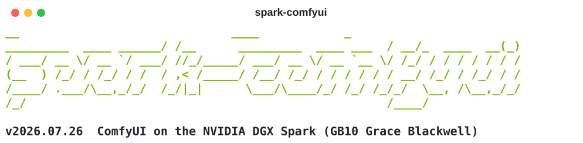
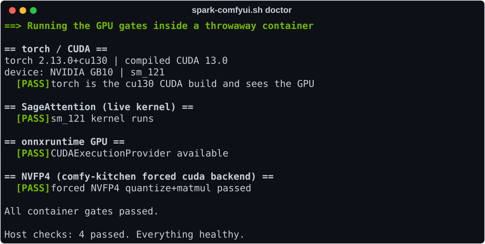

<div align="center">

<picture>
  <source media="(prefers-color-scheme: dark)" srcset="docs/banner-dark.svg">
  
</picture>

**One script to install, run, update, and maintain [ComfyUI](https://github.com/Comfy-Org/ComfyUI) on the NVIDIA DGX Spark (GB10 Grace Blackwell), fully containerized.**

[](https://github.com/bjarkebolding/spark-comfyui/actions/workflows/ci.yml)
[](https://github.com/bjarkebolding/spark-comfyui/releases)
[](LICENSE)


</div>

The whole GB10-tuned stack (cu130 PyTorch, native sm_121 SageAttention, GPU onnxruntime, the Spark mods) lives in a docker image. Your content (models, workflows, custom nodes, outputs) lives in a plain `data/` directory next to the script and is bind-mounted in. Custom-node code, which is arbitrary third-party Python, runs confined: non-root, no capabilities, nothing visible but your content and the GPU.

## Contents

[Quick start](#quick-start) · [Commands](#commands) · [What it looks like](#what-it-looks-like) · [Mounts](#mounts) · [Patch list](#patch-list-optional) · [Troubleshooting](#troubleshooting) · [Security notes](#security-notes)

## Quick start

Needs a DGX Spark (GB10) on DGX OS (docker, the NVIDIA Container Toolkit and the r580 driver ship with it), plus ~25 GB of disk before models.

```bash
git clone https://github.com/bjarkebolding/spark-comfyui.git
cd spark-comfyui
./spark-comfyui.sh install          # one-time image build, 10-30 min
./spark-comfyui.sh tune --persist   # recommended: swap off, persistence mode
./spark-comfyui.sh run              # UI at http://<spark-ip>:8188
```

Models go in `data/models/checkpoints` (etc.). No venv, no system Python changes; `sudo` is only used by `tune`.

## Commands

| Command | What it does |
|---|---|
| `install` | Builds the image: ComfyUI at a pinned commit, cu130 PyTorch, SageAttention compiled for sm_121, GPU onnxruntime (sha256-pinned), GB10 mods. Idempotent. |
| `run [args...]` | Starts ComfyUI in the container, foreground. Every start installs custom-node requirements and live-verifies the GPU stack before serving. Extra args pass to `main.py`. |
| `service [--disable]` | Same, detached with a docker restart policy: survives crashes and reboots. |
| `stop` | Stops ComfyUI. |
| `update [--torch] [--rollback] [--keep[=NAME]]` | Self-updates the tool, then rebuilds the image on current ComfyUI master (cached layers: minutes). The old image stays as `:previous`; `--rollback` swaps back instantly. `--torch` forces fresh PyTorch wheels. `--keep` also pins the image you are leaving as `:keep-NAME` (default: today's date), which survives every later update and `prune`. |
| `doctor` | Health check: tool and host (driver, docker, image, swap, backups), then the live GPU gates (torch CUDA, sm_121 SageAttention kernel, onnxruntime provider, NVFP4) inside a throwaway container. Every failure names its fix. |
| `status [--watch [SEC]]` | One-page glance, or a live sparkline dashboard with generation telemetry and a `session:` A/B summary. Every sample lands in `thermal_monitor.log`, the post-mortem trail for silent hard-reboots. |
| `tune [--clock-cap MHZ] [--persist]` | Host stability: swap off, persistence mode, optional clock cap (~2100 fixes overcurrent hard-reboots). |
| `backup [--with-output] [FILE]` | Small tgz of workflows, settings, inputs, configs and the custom-node set. Models are manifested, never archived. Safe while running. |
| `restore FILE` | Rebuilds from a backup: image if missing, content into `data/`, custom nodes re-cloned at pinned commits, missing models listed with sizes. |
| `prune [--yes]` | Reclaims disk: drops leftover image tags and trims the BuildKit cache to its age and size limits. Keeps `:latest`, `:previous` and every `keep-*` pin, and never rebuilds. Shows what goes before it goes. |
| `reset [--yes]` | Removes the container, all image tags and the cache volume; rebuilds from scratch. `data/` is never touched. Unlike `prune`, this does drop `keep-*` pins. |

Disk knobs, applied by `update` and `prune`: `CACHE_KEEP_DAYS` (default 7) drops build cache untouched for that long, `CACHE_MAX_GB` (default 40) caps its total size. Either at `0` disables that pass. The cap is the one that matters if you rebuild often, because the age filter measures last use and a frequent rebuild keeps every layer fresh.

Runtime knobs, set at `run` time: `SPARK_RESERVE_VRAM=8` keeps 8 GB of the unified pool free (hardens against the overcommit freeze when pushing large models), `SPARK_BF16=0` disables the bf16 fast path, `SPARK_BF16_VAE=0` keeps that fast path but takes the VAE off bf16, `SPARK_STATIC_VRAM=1` disables DynamicVRAM.

The VAE one has a flag form, `--no-bf16-vae`, which works with any command:

```bash
./spark-comfyui.sh service --no-bf16-vae          # LTX-2.3 audio workflows
./spark-comfyui.sh run --no-bf16-vae --fp32-vae   # or pick your own precision
```

## What it looks like

`status --watch` during a run. Heat-colored timeseries; rows appear only when they carry information:

```console
$ ./spark-comfyui.sh status --watch 3

  ─ GPU ──────────────────────────────────────────────────────────────────────
  temp         57°C ↗                   ▁▁▁▃▅▅▅▁▁▁▅▆▆▆▁▁▁▁▅▅▆█▃▁▁  46–61 ~53
  power      77.40W ↗                   ▁▁▁▇███▁▁▁████▁▁▁▁███▅▁▁▁  10.4–77.4 ~32.5
  sm clk    2411MHz                     ▂▂▅█▆▆▆▂▂▂▆▅▅▅▂▂▂▂▅▅▅▅▂▂▂  2398–2463 ~2421 P0
  gpu           96%                     ▁▁▄▇███▁▁▁████▁▁▁▁████▁▁▁  0–96 ~33.6
  ─ SYSTEM ───────────────────────────────────────────────────────────────────
  unified     22.7G                     ▁▁▃██████████████████████  4.1–23.6 ~20.9 of 122G
  cpu            5%                      ▁▃█▅▆▅▃▁▁▄▅▅▅▂▁▁▁▅▅▅▆▁▁▁  1–10 ~3.1
  disk io   0.0MB/s                      ▁▁▁▁▁▁▁▁▁▁▁▁▁▁▁█▁▁▁▁▁▁█▁  0–0.4 ~0.04
  ─ GENERATION · SageAttention ───────────────────────────────────────────────
  gen         13.1s                             ███████▁▁▁▁▁▁▁▁▁▁  13.1–29.8 ~17.3
  it/s         0.63                         ▁▃▃▄   █▃▃▄    █▃▃     0.4–1.36 ~0.72
  latency       13s                             ███████▅▅▅▅▅▅▅▁▁▁  13–30 ~17.4
  queue           0                     ▁▁▁█████▁▁▁████▁▁▁▁███▁▁▁  0–1 ~0.34
  hit rate      77%                             ▁▁▁▁▁▁▁██████████  0–77 ~57.8
  session: 4 gens · first 29.8s · steady ~13.6s (13.6–13.6) · ~0.63 it/s
```

> [!TIP]
> The `session:` line is made for A/B tests: run one watch per condition and compare. That is how the container itself was validated: native steady 13.59s vs container 13.61s on the same workflow and seeds, every seed-matched output pair bit-identical.

A healthy `doctor` looks like this. The gates run inside a throwaway container from the exact image `run` uses:

<div align="center">
  
</div>

## Mounts

Everything lives under `data/` by default. To relocate entries or add extra mounts, edit `spark-mounts.conf` next to the script (a commented template is seeded on install):

```
models = /mnt/fast-ssd/models
output = /mnt/nas/comfyui-output
mount = /mnt/nas/sdxl-models:/opt/ComfyUI/models/nas:ro
```

`status` always prints the resolved table. A typo in a `mount =` line dies loudly instead of silently shadowing your data with an empty directory. Point `extra_model_paths.yaml` entries at the container side of `mount =` lines.

Absolute paths are used as given and `~` is expanded. A configured directory does not have to exist yet, but its parent must, so a typo or an unmounted share fails loudly instead of quietly mounting an empty directory. Relative paths resolve against the config file's own directory.

For several setups, keep one file each and pick one per invocation with `--mounts`:

```bash
./spark-comfyui.sh --mounts ./nas-profile.conf run
./spark-comfyui.sh --mounts ./nas-profile.conf status   # check what it resolves to
```

The flag works with every command and must name a file that exists, so a typo fails loudly instead of quietly mounting the defaults. `MOUNTS_CONF=PATH` does the same thing as an environment variable. Use it on `backup` and `restore` too so they act on that setup. To run two setups at once, add `CONTAINER_NAME` and `PORT` overrides.

## Patch list (optional)

`comfyui-patches.list` next to the script merges upstream PRs or fork branches (`pr:12345`, `branch:name`, `remote:<url> <branch>`) on top of ComfyUI inside the image build. A conflict fails the build loudly. Empty list means plain master tracking.

## Troubleshooting

Start with `./spark-comfyui.sh doctor`; every failure names its fix. Common ones:

- **An update broke generation**: `update --rollback`, restart.
- **A custom node will not load**: check the start log; the entrypoint installs each node's requirements and warns per node. A node needing a system library the image lacks is worth an issue.
- **Silent hard-reboot during video generation**: `status --watch`, reproduce, read the last logged lines. A power spike right before death is overcurrent; fix with `tune --clock-cap 2100`.
- **Machine freezes near memory limit**: swap thrash on unified memory; run `tune`.
- **Docker is eating the disk**: `prune`. Images and BuildKit cache are the two things that grow silently, and a full filesystem stops a rebuild dead. It keeps `:latest`, `:previous` and every `keep-*` pin, shows exactly what goes first, and never rebuilds. `doctor` reports both numbers on every run.

  ```console
  $ ./spark-comfyui.sh prune --yes

    Leftover image tags (nothing references these):
      spark-comfyui:2026.07.26                       11.3GB
      spark-comfyui:2026.07.27                       11.3GB
      spark-comfyui:2026.07.28                       11.3GB
      spark-comfyui:2026.07.29                       11.4GB
      spark-comfyui:2026.07.31                       11.4GB
      spark-comfyui:2026.08.02                       11.4GB
    Untagged spark-comfyui images (matched by image label):
      906dbbaf56d4                                   11.3GB
    Build cache: 95 GB reclaimable, trimming to 7d / 40 GB

    Kept: spark-comfyui:latest, :previous, and every keep-* pin.
    Your content (data/) and the run-time cache volume are not touched.

  ==> Removed 7 leftover image(s)
    Disk now: 273G free of 917G (69% used)
  ```
- **LTX-2.3 audio workflows fail with `Input type (float) and bias type (c10::BFloat16)`**: the audio VAE never casts the input waveform to the VAE dtype, so it cannot run under `--bf16-vae`. This affects every LTX-2.3 audio workflow, including the templates ComfyUI ships. Start with `--no-bf16-vae`; the unet and text-encoder speedups are kept. You cannot fix this by passing `--fp32-vae` instead, because ComfyUI's VAE precision flags are mutually exclusive and the entrypoint has already added `--bf16-vae`.
- **Not sure SageAttention is really active?**: on this build it cannot silently fall back to plain attention, the failure mode most Spark guides warn about. The image compiles a native sm_121 kernel, and every start runs a live multi-shape kernel test that refuses to launch if it fails. `doctor` runs the same gate on demand.

> [!NOTE]
> The `sm_121 exceeds torch's supported maximum` line at startup is expected on GB10 and harmless. PyTorch JITs the kernels through PTX.

## Security notes

- Custom nodes run as a non-root user with all capabilities dropped and only your content directories and the GPU visible. A malicious node cannot read your SSH keys or anything else on the host.
- The image is reproducible from this repo: pinned ComfyUI commit, sha256-pinned onnxruntime wheel, pinned SageAttention. `update --rollback` returns to the previous image atomically.

> [!WARNING]
> Manager's `personal_cloud` mode is fine on a trusted LAN. Do not expose the port to the internet.

---

MIT, see [LICENSE](LICENSE). The GB10 knowledge here comes from the NVIDIA DGX Spark developer forums, the [dgx-spark-playbooks](https://github.com/NVIDIA/dgx-spark-playbooks), and the community projects that mapped this hardware in public.
